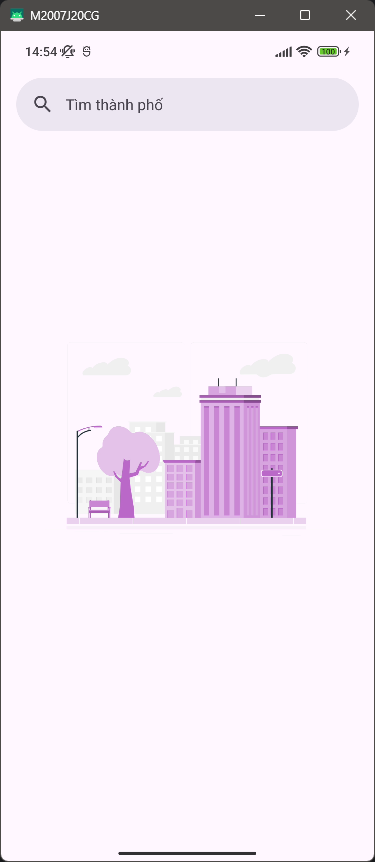
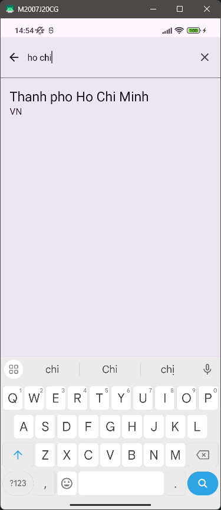
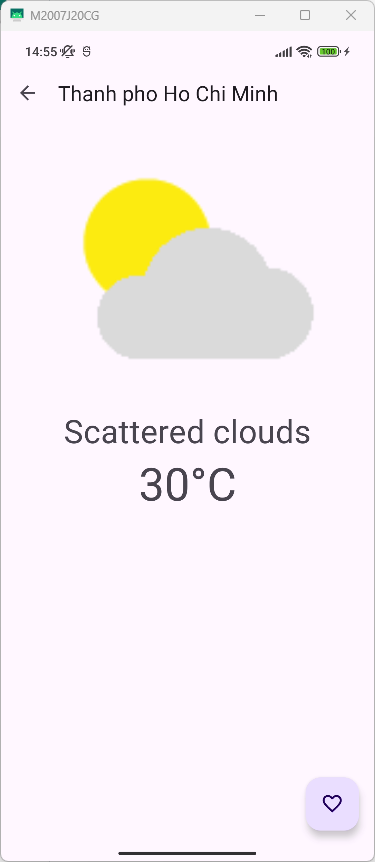

# WeatherForecast

WeatherForecast is an Android app that provides current weather information. The app includes two screens:

1. **Favorite Cities List**: This screen displays a list of your favorite cities, allowing you to search and select cities.
2. **City Weather Details**: After selecting a city from the search results or the favorite list, you will be taken to the City Weather Details screen. Here, you can view the current weather information and add or remove the city from your favorites.

## Features

- **Search for Cities**: Quickly find cities and view their current weather conditions.
- **Favorite Cities Management**: Add or remove cities from your favorites list.
- **Current Weather Information**: View detailed weather information for your selected cities.

## Upcoming Features

- View weather based on your current location.
- Select a location on the map to view weather information.
- View weather forecasts for the upcoming week.
- Improve the app interface for a better user experience.

## APK Download

You can download the app directly and experience it by installing the APK from [here](./apk/WeatherForecast.apk).

## Screenshots

**Favorites List**



**City Search**



**Weather Details**



# Developer Guide

## Installation

To run this project on your local machine:

1. Clone the repository:
    ```bash
    git clone https://github.com/hhhai0304/WeatherForecast.git
    ```

2. Open the project in Android Studio.

3. Create a new file named `apikey.properties` in the root directory with the following content:
    ```properties
    API_KEY="2fc6e86b506943f5bf544420e1b83ae5"
    ```

4. Build and run the project on an emulator or a physical device.

## Libraries Used

- **Retrofit2**: For API communication.
- **Moshi**: For JSON processing.
- **Realm database**: For offline storage of city lists and user favorite cities.
- **Koin**: For dependency injection.
- **Glide**: For displaying weather icons.
- **Coroutines**: For handling asynchronous tasks.
- **Timber**: For logging.
- **Material Design components, DataBinding, and ViewBinding**: For UI development.

## Project Structure

- **App.kt**: Sets up dependency injection, logging, and initializes the city list from assets/city.json into the Realm database on the first app launch.
- **Activity and Fragments**: The project is structured with one main Activity that contains multiple Fragments.
- **Directories**:
    - **database**: Contains DAO classes for CRUD operations with Realm database and entities representing each table.
    - **model**: Contains ViewModel classes and JSON models.
    - **network**: Contains services for Retrofit2 API communication, custom exceptions, interceptors, and responses.
    - **repository**: Aggregates data from DAOs and services for interaction with ViewModel.
    - **ui**: Contains directories for each screen, with each directory including related fragments, viewmodels, and adapters.
    - **util**: Contains necessary utilities, constants, and binding adapters for the project.

## License

This project is licensed under the MIT License - see the [LICENSE](LICENSE) file for details.
